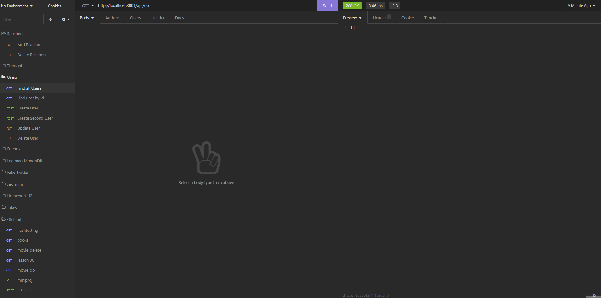

# Social Network API 

## Description

I built this social networking back-end server application by utilizing mongoDB, mongoose and Express package. This program has full CRUD (create, read, update, and delete) functionality through API routes.

## Table of Contents

- [Installation](#installation)
- [Usage](#usage)
- [License](#license)
- [Contributing](#contributing)
- [Tests](#tests)
- [Questions](#questions)

## Installation

- Clone [this repo](https://github.com/idpetersen/social-api) from my Github to the users computer by running the command in the terminal.

`git clone <ssh key>`

- Open VScode with this repository and run the following command with the integrated terminal.

`npm i`

- The user will have to have MongoDB installed on their computer. Click [here](https://docs.mongodb.com/manual/installation/) to learn how to install MongoDB

- To launch the application on the user's local computer, the following command will need to be ran

`node server.js`

## Usage

The user can install this application on their local maching by following the instructions above. The demo for this program uses Insomnia to execute CRUD requests. To learn how to use and install insomnia click [here](https://insomnia.rest/)

OR

[Watch this walkthrough video](https://drive.google.com/file/d/1WOqCMFK4shXJYLNxpELp4ktPqnRKZDsI/view)

### User Routes

  
The five routes availible to handle requests for users:

- Find all Users route returns a JSON containing all products in the database.

- Find User by ID returns a JSON containing a specific User as requested by the client.

- Update User updates an existing User by ID.

- Create User creates a new User.

- Delete User takes an ID of a User that exists and deletes it.

### Friend Routes

The two routes availible to handle requests for friends:

- Add friend takes one User's Id that you want to add a friend to and another User's Id (new friend) and updates the friend list of the first user.

- Delete friend takes one User's Id that you want to delete a friend from and another User's Id (deleted friend) and updates the friend list of the first user.

### Thought Routes

  
The five routes availible to handle requests for thoughts:

- Find all Thoughts route returns a JSON containing all thoughts.

- Find Thought by Id route returns a JSON containing the requested thought by Id.

- Create Thought route creates a new thought with the user's username and thought text.

- Update Thought route updates an existing thought by Id that only takes thoughtText in the JSON request.

- Delete Thought route deletes a thought by it's Id.
### Reaction Routes

  
The two routes availible to handle requests for reactions:

- Add reaction route takes a reaction body and username and adds a reaction to an existing thought by it's Id.

- Delete reaction route deletes a reaction by it's thought Id and it's own Id.

## License

MIT License

Copyright &copy; Isaac Petersen 2022

Permission is hereby granted, free of charge, to any person obtaining a copy
of this software and associated documentation files (the "Software"), to deal
in the Software without restriction, including without limitation the rights
to use, copy, modify, merge, publish, distribute, sublicense, and/or sell
copies of the Software, and to permit persons to whom the Software is
furnished to do so, subject to the following conditions:

The above copyright notice and this permission notice shall be included in all
copies or substantial portions of the Software.

THE SOFTWARE IS PROVIDED "AS IS", WITHOUT WARRANTY OF ANY KIND, EXPRESS OR
IMPLIED, INCLUDING BUT NOT LIMITED TO THE WARRANTIES OF MERCHANTABILITY,
FITNESS FOR A PARTICULAR PURPOSE AND NONINFRINGEMENT. IN NO EVENT SHALL THE
AUTHORS OR COPYRIGHT HOLDERS BE LIABLE FOR ANY CLAIM, DAMAGES OR OTHER
LIABILITY, WHETHER IN AN ACTION OF CONTRACT, TORT OR OTHERWISE, ARISING FROM,
OUT OF OR IN CONNECTION WITH THE SOFTWARE OR THE USE OR OTHER DEALINGS IN THE
SOFTWARE.

  

## Contributing

To contribute, please contact me via [Github](https://www.github.com/idpetersen) or [email](mailto:isaac.petersen5@gmail.com)

## Tests

Testing was completed and done by me through the integrated terminal of VScode.

## Questions

Contact me via [Github](https://www.github.com/idpetersen) or [email](mailto:isaac.petersen5@gmail.com)